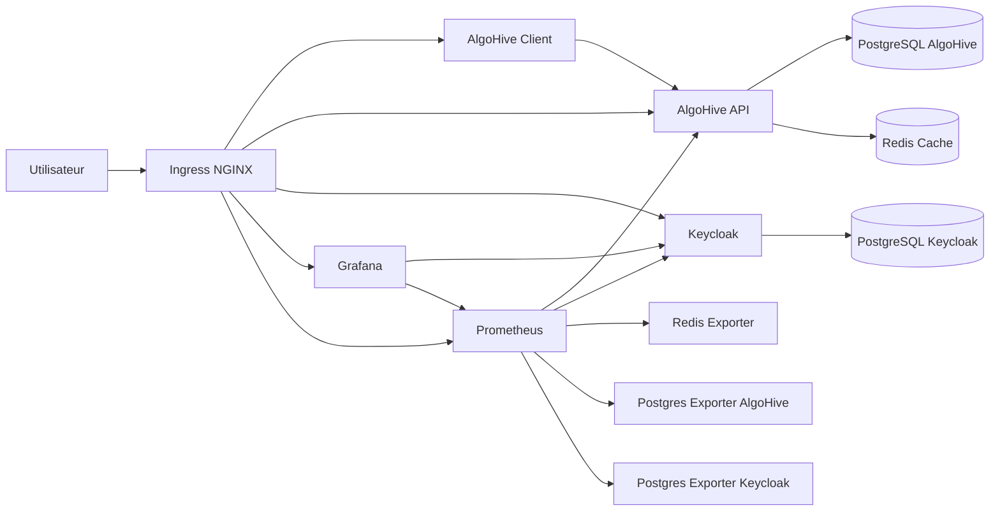

# AlgoHive Projet

Documentation d'architecture et de déploiement d'une plateforme `AlgoHive` locale sur `kind` avec:

- `AlgoHive-Client`
- `AlgoHive-API`
- `PostgreSQL`
- `Redis`
- `Keycloak`
- `Prometheus`
- `Grafana`

Cette base sert à présenter une solution cohérente pour:

- exécuter la plateforme en local dans Kubernetes
- centraliser l'identité avec `Keycloak`
- superviser l'ensemble avec `Prometheus` et `Grafana`

Le dépôt contient maintenant aussi les manifests et scripts de déploiement dans [deploy/README.md](deploy/README.md).

## Architecture

Le schéma détaillé est disponible dans [docs/architecture.md](docs/architecture.md).

### Vue d'ensemble

## Composants

### AlgoHive Client

- interface web principale
- exposée via `Ingress`
- consomme `AlgoHive-API`

### AlgoHive API

- backend Go de la plateforme
- gère authentification native, compétitions, utilisateurs, rôles et métriques
- expose `/api/v1/metrics` pour `Prometheus`

### PostgreSQL

- une base pour `AlgoHive`
- une base dédiée pour `Keycloak`

### Redis

- cache applicatif utilisé par `AlgoHive-API`

### Keycloak

- fournisseur d'identité transverse
- prépare le terrain pour une future migration OIDC de la plateforme
- déjà branché à `Grafana` via `Generic OAuth`

### Prometheus

- collecte les métriques de:
  - `AlgoHive-API`
  - `Keycloak`
  - `Redis exporter`
  - `PostgreSQL exporter`

### Grafana

- visualisation centralisée
- datasource `Prometheus` préconfigurée
- SSO `Keycloak` préconfiguré

## Déploiement local sur kind

Le guide pas à pas est disponible dans [docs/deploiement-kind.md](docs/deploiement-kind.md).

Une version plus guidée, orientée exécution étape par étape, est disponible dans [docs/pas-a-pas.md](docs/pas-a-pas.md).

## Limites actuelles

- stockage local volatile
- secrets de démonstration à remplacer
- authentification AlgoHive encore native
- pas encore d'alerting `Alertmanager`

## Roadmap recommandée

1. Migrer l'authentification AlgoHive vers OIDC avec `Keycloak`
2. Remplacer `emptyDir` par des volumes persistants
3. Déporter les secrets vers un gestionnaire dédié
4. Ajouter alertes et dashboards métier
5. Préparer une variante `Helm` ou `Argo CD`
