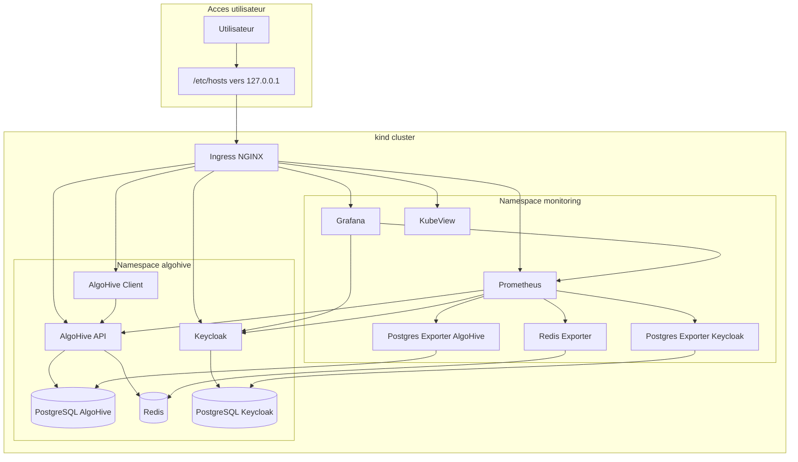
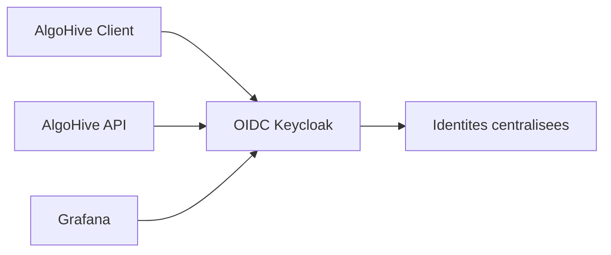

# Architecture AlgoHive sur kind

## Objectif

Cette architecture propose une plateforme locale `Kubernetes` pour `AlgoHive`, enrichie avec:

- une brique IAM `Keycloak`
- une supervision complète `Prometheus` + `Grafana`
- une exposition applicative par `Ingress NGINX`

## Schéma global



## Flux principaux

### Flux utilisateur

1. L'utilisateur accède à `algohive.local`, `grafana.algohive.local` ou `keycloak.algohive.local`
2. `Ingress NGINX` route la requête vers le bon service Kubernetes
3. Le client AlgoHive appelle l'API
4. L'API utilise `PostgreSQL` et `Redis`

### Flux IAM

1. `Keycloak` centralise les identités
2. `Grafana` délègue l'authentification à `Keycloak` via `OpenID Connect`
3. les rôles Keycloak peuvent être traduits en rôles Grafana

### Flux observabilité

1. `Prometheus` collecte les métriques de l'API, de `Keycloak` et des exporters
2. `Grafana` interroge `Prometheus`
3. l'équipe consulte les tableaux de bord et l'état de santé global

## Découpage logique

### Namespace `algohive`

- services métier
- bases de données applicatives
- IAM `Keycloak`

### Namespace `monitoring`

- collecte de métriques
- visualisation
- visualisation de cluster avec `KubeView`
- exporters de dépendances

## Hôtes locaux recommandés

```text
127.0.0.1 algohive.local
127.0.0.1 keycloak.algohive.local
127.0.0.1 grafana.algohive.local
127.0.0.1 prometheus.algohive.local
127.0.0.1 kubeview.algohive.local
```

## Choix d'architecture

### Pourquoi kind

- simple à lancer en local
- pratique pour démonstration, POC et intégration
- proche du modèle d'exploitation Kubernetes réel

### Pourquoi deux bases PostgreSQL

- séparation claire des responsabilités
- isolation entre données métier et IAM
- simplification des sauvegardes et de l'administration

### Pourquoi Keycloak maintenant

- préparation de la centralisation IAM
- possibilité de brancher plusieurs briques tierces
- cohérence future pour AlgoHive, Grafana et d'autres services

### Pourquoi Prometheus et Grafana

- standard observabilité Kubernetes
- intégration simple avec l'API et `Keycloak`
- extensibilité facile avec exporters et alertes

## Limites de cette version

- persistance non durcie
- secrets en clair dans les manifests de démonstration
- pas de TLS local
- AlgoHive n'utilise pas encore directement OIDC

## Cible d'évolution



L'évolution naturelle consiste à faire de `Keycloak` l'autorité d'authentification commune à toute la solution.
